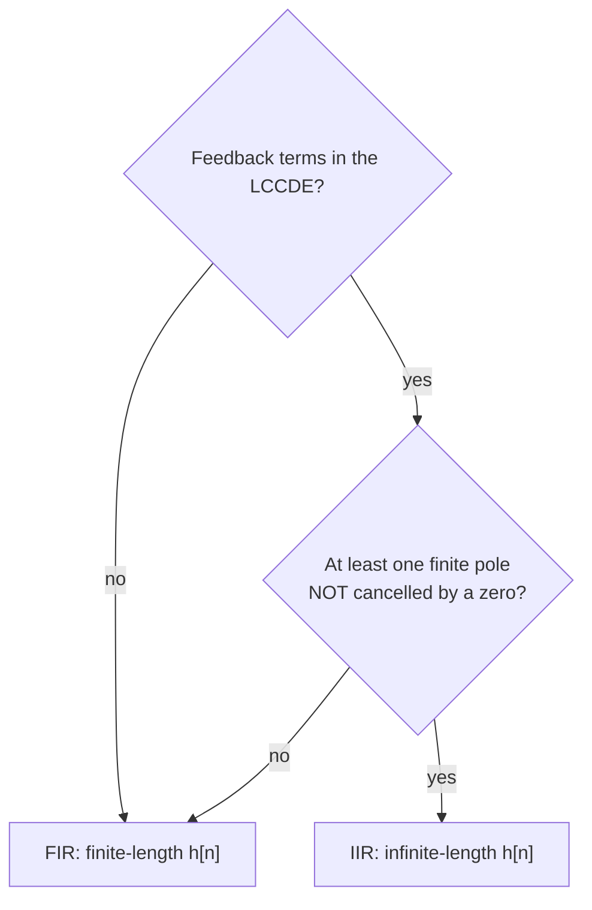

*Lecture 9 · Mon Sep 14, 2026 · notes + slides "Transfer functions and LTI system response: Part 1" · prev: [[2-z-transform/08-inverse-z-transform|Lecture 8]] · next: [[2-z-transform/10-improper-transfer-functions-and-system-algebra|Lecture 10]]*

> [!abstract] In one breath
> Convolution in time is multiplication in $z$, so an LTI system is completely described by one rational function, its **transfer function** $H(z) = Y(z)/X(z)$ — the z-transform of $h[n]$. Taking the z-transform of an LCCDE $y[n] + \sum a_k y[n-k] = \sum b_k x[n-k]$ turns every delay into a factor $z^{-k}$ and gives $H(z) = \dfrac{\sum b_k z^{-k}}{1 + \sum a_k z^{-k}}$ in one line; reading it backwards turns any $H(z)$ into a difference equation. The roots of the numerator are **zeros**, of the denominator **poles**; uncancelled finite poles mean an infinite impulse response. To get an output you **multiply** $X(z)H(z)$, **cancel** common factors (an input zero can kill a system pole), and **invert** by partial fractions. This chain — LCCDE → $H(z)$ → poles/zeros/ROC → response — is a 15–20-point problem on every past exam.

## 1. LTI response in the z-domain

For an LTI system with impulse response $h[n]$, the output is $y[n] = x[n] * h[n]$. The convolution property ([[2-z-transform/07-z-transform-properties|Lecture 7]]) turns that into a product:

> [!key] Transfer function
> $$
> \begin{aligned}
> Y(z) &= H(z)\,X(z), \qquad \text{ROC at least } R_x \cap R_h, \qquad\qquad \\
> H(z) &= \frac{Y(z)}{X(z)} = \mathcal{Z}\{h[n]\} .
> \end{aligned}
> $$
> Two routes to any output: the convolution sum ([[1-signals-and-systems/04-impulse-response-and-convolution|Lecture 4]]), or multiply in $z$ and take the inverse z-transform ([[2-z-transform/08-inverse-z-transform|Lecture 8]]).

"At least" matters: when a zero of one factor cancels a pole of the other, the ROC of $Y$ can be *larger* than $R_x \cap R_h$. SP2021 #7: $R_x = \{\tfrac13 < |z| < 4\}$ and $R_h = \{|z| > 1\}$, but the zero of $H$ at $4$ cancels the pole of $X$ at $4$, so the ROC of $Y$ is all of $|z| > 1$ and $y[n]$ is right-sided even though $x[n]$ is two-sided.

## 2. From an LCCDE to $H(z)$ — and back

Lecture 9 writes a (causal) LCCDE with all output terms on the left:
$$
y[n] + \sum_{k=1}^{N} a_k\, y[n-k] = \sum_{k=0}^{M-1} b_k\, x[n-k],
$$
$N$ feedback terms, $M$ input terms. Take the z-transform of both sides, using linearity and the time-shift property $x[n-k] \leftrightarrow z^{-k}X(z)$:
$$
\begin{aligned}
Y(z) + \sum_{k=1}^{N} a_k z^{-k}\,Y(z) &= \sum_{k=0}^{M-1} b_k z^{-k}\,X(z)\\
Y(z)\Bigl(1 + \sum_{k=1}^{N} a_k z^{-k}\Bigr) &= X(z)\sum_{k=0}^{M-1} b_k z^{-k} .
\end{aligned}
$$

> [!key] LCCDE ⇄ transfer function
> $$
> \begin{aligned}
> &H(z) = \frac{Y(z)}{X(z)} = \frac{\displaystyle\sum_{k=0}^{M-1} b_k z^{-k}}{\displaystyle 1 + \sum_{k=1}^{N} a_k z^{-k}} \\
> \qquad\Longleftrightarrow\qquad
> &y[n] + \sum_{k=1}^{N} a_k\,y[n-k] = \sum_{k=0}^{M-1} b_k\,x[n-k] .
> \end{aligned}
> $$
> Numerator ↔ input taps, denominator ↔ feedback taps, $z^{-k}$ ↔ "delay by $k$". This is the form `scipy.signal.lfilter(b, a, x)` expects, with `a[0] = 1`.

This buys two things: the impulse response of *any* LCCDE (compute $H$, invert it), and the response to any input without touching the convolution sum.

> [!recipe] LCCDE → $H(z)$ → LCCDE
> **Forward.** (1) Move every $y$ term to the left side. (2) Replace $y[n-k]$ by $z^{-k}Y(z)$ and $x[n-k]$ by $z^{-k}X(z)$. (3) Factor out $Y$ and $X$; $H = Y/X$. (4) Factor numerator and denominator (zeros, poles), then fix the ROC from what you are told: **causal → outside the largest pole**; stable → the ring containing $|z| = 1$ ([[2-z-transform/11-bibo-stability-and-causality|Lecture 11]]).
> **Backward.** Multiply out the factored denominator, cross-multiply $Y(z)\cdot\text{den} = X(z)\cdot\text{num}$, and read each $z^{-k}$ as a delay by $k$. Example (SP2025 #8(a)): $H = \dfrac{2-3z^{-1}}{(1-\frac12 z^{-1})(1+\frac32 z^{-1})} = \dfrac{2-3z^{-1}}{1+z^{-1}-\frac34 z^{-2}}$ gives $y[n] + y[n-1] - \tfrac34 y[n-2] = 2x[n] - 3x[n-1]$.

> [!trap] Lecture 5 vs Lecture 9: the feedback signs flip (and the letter $b$ changes job)
> [[1-signals-and-systems/05-difference-equations-and-block-diagrams|Lecture 5]] writes $y[n] = \sum_{i=1}^{K} b_i\, y[n-i] + \sum_{j=0}^{M-1} c_j\, x[n-j]$ — feedback on the **right**, and there $b_i$ are the *feedback* coefficients. Lecture 9 puts feedback on the **left** with coefficients $a_k$, so $a_k = -b_k^{(\text{L5})}$, while $b_k^{(\text{L9})} = c_k^{(\text{L5})}$ are the input coefficients. So $y[n] = \tfrac12 y[n-1] + \tfrac{3}{16}y[n-2] + \dots$ has denominator $1 - \tfrac12 z^{-1} - \tfrac{3}{16}z^{-2}$ (and `a = [1, -1/2, -3/16]` in Python). Writing $1 + \tfrac12 z^{-1} + \dots$ puts every pole in the wrong place — the most common way to lose the whole problem.

> [!trap] The LCCDE alone does not fix the ROC
> $y[n] - \tfrac12 y[n-1] = x[n]$ is satisfied by the causal $(\tfrac12)^n u[n]$ *and* by the anti-causal $-(\tfrac12)^n u[-n-1]$ (FA2019 1(a): "can be causal or anti-causal" — True). The words "causal", "stable" or "initially at rest" in the problem pick the ROC; say which one you used.

## 3. Impulse responses of LCCDEs (the lecture's exercises)

**Notes, Exercise 1** (revisiting Lecture 5): $y[n] = \tfrac12 y[n-1] + x[n]$ gives $Y(z)\bigl(1 - \tfrac12 z^{-1}\bigr) = X(z)$, so $H(z) = \dfrac{1}{1-\frac12 z^{-1}}$, $|z| > \tfrac12$ (causal), and by inspection $h[n] = (\tfrac12)^n u[n]$ — the answer Lecture 5 got by iterating. (Slide 5 does the same with $\tfrac13$: $h[n] = (\tfrac13)^n u[n]$.)

> [!question] Slides, Exercises 2 and 3 — impulse responses of causal LCCDEs
> (2) $y[n] = \tfrac13 y[n-1] + x[n] - 3x[n-1] + x[n-2]$  (3) $y[n] = \tfrac12 y[n-1] + \tfrac{3}{16} y[n-2] + x[n] - 3x[n-1]$

> [!success]- Answers (checked against `lfilter` on $\delta[n]$)
> **(2)** $H(z) = \dfrac{1-3z^{-1}+z^{-2}}{1-\frac13 z^{-1}} = \dfrac{1}{1-\frac13 z^{-1}} - \dfrac{3z^{-1}}{1-\frac13 z^{-1}} + \dfrac{z^{-2}}{1-\frac13 z^{-1}}$, $|z| > \tfrac13$. Linearity and time shifts give
> $$
> \begin{aligned}
> h[n] &= \left(\tfrac13\right)^n u[n] - 3\left(\tfrac13\right)^{n-1} u[n-1] + \left(\tfrac13\right)^{n-2} u[n-2] \\
> &= \left(\tfrac13\right)^n u[n] - 3\,\delta[n-1],
> \end{aligned}
> $$
> ($h = \{\underset{\uparrow}{1}, -\tfrac83, \tfrac19, \tfrac1{27}, \dots\}$). The short form is what long division gives: $H = -3z^{-1} + \dfrac{1}{1-\frac13 z^{-1}}$ — this $H$ is *improper* (numerator degree 2 ≥ denominator degree 1), the subject of [[2-z-transform/10-improper-transfer-functions-and-system-algebra|Lecture 10]].
> **(3)** $H(z) = \dfrac{1-3z^{-1}}{1-\frac12 z^{-1}-\frac{3}{16}z^{-2}} = \dfrac{1-3z^{-1}}{(1+\frac14 z^{-1})(1-\frac34 z^{-1})} = \dfrac{A_1}{1+\frac14 z^{-1}} + \dfrac{A_2}{1-\frac34 z^{-1}}$. Cover-up: $A_1 = \dfrac{1-3z^{-1}}{1-\frac34 z^{-1}}\Big|_{z=-1/4} = \dfrac{1+12}{1+3} = \dfrac{13}{4}$, $A_2 = \dfrac{1-3z^{-1}}{1+\frac14 z^{-1}}\Big|_{z=3/4} = \dfrac{1-4}{1+\frac13} = -\dfrac94$. Causal, so
> $$
> h[n] = \tfrac{13}{4}\left(-\tfrac14\right)^n u[n] - \tfrac94\left(\tfrac34\right)^n u[n] .
> $$

The Python side of Exercise 3 — `residuez` returns exactly the $A_k$ and $p_k$ of the PFE form $\sum_k \frac{A_k}{1-p_k z^{-1}}$, and `lfilter` runs the recursion:

```python
import numpy as np
from scipy.signal import lfilter, residuez

# Slides Exercise 3 (causal): y[n] = 1/2 y[n-1] + 3/16 y[n-2] + x[n] - 3x[n-1]
b = [1, -3]               # x-side: b_0, b_1
a = [1, -1/2, -3/16]      # y-side in the Lecture 9 form 1 + a_1 z^-1 + a_2 z^-2 (signs flip!)
r, p, k = residuez(b, a)  # H(z) = sum_i r_i / (1 - p_i z^-1) + direct terms k
print("A_k:", np.round(r.real, 4), " p_k:", np.round(p.real, 4), " k:", k)

n = np.arange(8)
h = lfilter(b, a, (n == 0).astype(float))        # run the recursion on delta[n]
h_closed = 13/4 * (-1/4)**n - 9/4 * (3/4)**n     # the PFE answer
print(np.round(h, 4))
print("closed form matches:", np.allclose(h, h_closed))
```

```text
A_k: [ 3.25 -2.25]  p_k: [-0.25  0.75]  k: []
[ 1.     -2.5    -1.0625 -1.     -0.6992 -0.5371 -0.3997 -0.3005]
closed form matches: True
```

## 4. Poles, zeros, order — and FIR vs IIR

Multiply numerator and denominator of $H(z)$ by a power of $z$ to get polynomials in $z$: the **zeros** are the roots of the numerator, the **poles** the roots of the denominator ([[concepts/poles-and-zeros|poles and zeros]]). The $N$ feedback terms give $N$ poles — the roots of $z^N + a_1 z^{N-1} + \dots + a_N$ — and $N$ is the **order** of the system. The input taps $b_0,\dots,b_{M-1}$ give the zeros: the numerator has degree $M-1$ in $z^{-1}$, so $M-1$ of them (the notes say "$M$ zeros"; count them yourself), plus extra poles or zeros at $z = 0$ so that the totals balance. A pole and a zero at the same place **cancel**: $H$ neither blows up nor vanishes there, and that pole is gone for every purpose (ROC, stability, FIR/IIR).

> [!tip] `tf2zpk` reads positive powers unless the arrays have equal length
> `scipy.signal.tf2zpk(b, a)` treats `b` and `a` as polynomials in $z$ (descending powers). For the $z^{-1}$ form, **pad the shorter array with zeros**: `tf2zpk([1, -3, 1], [1, -1/3, 0])` gives zeros $\tfrac{3\pm\sqrt5}{2}$ and poles $\tfrac13, 0$; without the padding the pole at $0$ is silently dropped. For poles alone, `np.roots(a)` is always safe.

A feedback term like $y[n-1]$ is what lets a two-term LCCDE have an infinitely long $h[n]$. Precisely: **any finite pole (not at $z = 0$ or $\infty$) that is not cancelled by a zero makes the system IIR**; no finite poles (denominator a monomial, e.g. $N = 0$) makes it FIR. Consequently a causal FIR system has poles only at $z = 0$ (a non-causal one also at $z = \infty$) — which is why FIR systems are always stable (Lecture 11). The slide-8 flowchart:



> [!example] Feedback, yet FIR — and a cancellation that stays IIR
> $y[n] = y[n-1] + x[n] - x[n-2]$: $H = \dfrac{1-z^{-2}}{1-z^{-1}} = \dfrac{(1-z^{-1})(1+z^{-1})}{1-z^{-1}} = 1 + z^{-1}$, so $h[n] = \delta[n] + \delta[n-1]$ — FIR although it has feedback.
> HW4 #6: $y[n] = x[n] + \tfrac12 x[n-1] - y[n-1] - \tfrac14 y[n-2]$ gives $H = \dfrac{1+\frac12 z^{-1}}{(1+\frac12 z^{-1})^2} = \dfrac{1}{1+\frac12 z^{-1}}$: one of the two poles at $-\tfrac12$ cancels, the other survives, $h[n] = (-\tfrac12)^n u[n]$ — still IIR.
> (FA2024 1(d)–(e): an LCCDE has only finitely many poles — True; $y[n] = y[n-3] + x[n]$ has three distinct poles, the cube roots of unity — True.)

## 5. Computing a response: multiply, cancel, expand

> [!recipe] Output of an LTI system via the z-transform
> 1. Get $H(z)$ with its ROC (from the LCCDE + "causal"/"stable") and $X(z)$ with its ROC.
> 2. Form $Y = HX$ and **cancel common factors** before anything else: an input zero can remove a system pole (FA2025 #6, SP2023 #5), a system zero can remove an input pole (FA2023 #7(b)). See [[concepts/pole-zero-cancellation|pole-zero cancellation]].
> 3. ROC of $Y$: at least $R_x \cap R_h$; for a causal system and a right-sided input, simply outside the largest *remaining* pole.
> 4. Partial fractions ([[concepts/partial-fraction-expansion|PFE]], cover-up $A_k = (1-p_k z^{-1})Y(z)\big|_{z=p_k}$); if the numerator degree is ≥ the denominator degree, long-divide first (Lecture 10). Invert term by term with the ROC.

> [!question] FA2025 #6 (16 pts) — causal LCCDE $y[n] = \tfrac43 y[n-1] + \tfrac43 y[n-2] + x[n] - x[n-2]$
> (a) Find $H(z)$, its poles, zeros and ROC. (b) Find the response to $x[n] = 3\delta[n] + 2\delta[n-1]$.

> [!success]- Solution (exact rational arithmetic check over 40 samples)
> **(a)** $Y(z)\bigl(1 - \tfrac43 z^{-1} - \tfrac43 z^{-2}\bigr) = X(z)\bigl(1 - z^{-2}\bigr)$. The roots of $z^2 - \tfrac43 z - \tfrac43$ are $2$ and $-\tfrac23$, so
> $$
> \begin{gathered}
> H(z) = \frac{(1-z^{-1})(1+z^{-1})}{(1-2z^{-1})(1+\frac23 z^{-1})}, \qquad \\
> \text{zeros } \pm1,\quad \text{poles } 2,\ -\tfrac23,\quad \text{ROC } |z| > 2 \ (\text{causal}).
> \end{gathered}
> $$
> **(b)** $X(z) = 3 + 2z^{-1} = 3\bigl(1 + \tfrac23 z^{-1}\bigr)$ — a zero exactly on the pole $-\tfrac23$. It cancels:
> $$
> \begin{aligned}
> Y(z) &= \frac{3(1-z^{-2})}{1-2z^{-1}} = \frac{3}{1-2z^{-1}} - \frac{3z^{-2}}{1-2z^{-1}},\ |z| > 2 \\
> \quad\Longrightarrow\quad y[n] &= 3(2)^n u[n] - 3(2)^{n-2}u[n-2] .
> \end{aligned}
> $$
> (Equivalently $y = 3h[n] + 2h[n-1]$, the key's alternative; or $3\delta[n] + 6\delta[n-1] + \tfrac94\,2^n u[n-2]$.)

<figure class="ece-fig"><svg xmlns="http://www.w3.org/2000/svg" viewBox="0 0 680 300" width="680" height="300" role="img" style="font-family:'Source Sans 3','Source Sans Pro',system-ui,sans-serif;font-size:14px;max-width:100%;height:auto"><line x1="173.0" y1="9.0" x2="183.0" y2="19.0" stroke="var(--hi)" stroke-width="2.4" stroke-linecap="round"/><line x1="173.0" y1="19.0" x2="183.0" y2="9.0" stroke="var(--hi)" stroke-width="2.4" stroke-linecap="round"/><text x="188.0" y="18.0" text-anchor="start" fill="currentColor" style="font-size:12.5px;">pole</text><circle cx="240.0" cy="14.0" r="6.0" fill="none" stroke="currentColor" stroke-width="2"/><text x="252.0" y="18.0" text-anchor="start" fill="currentColor" style="font-size:12.5px;">zero</text><circle cx="306.0" cy="14.0" r="8.0" fill="none" stroke="var(--accent2)" stroke-width="2.4"/><text x="320.0" y="18.0" text-anchor="start" fill="currentColor" style="font-size:12.5px;">zero of X(z)</text><line x1="412.0" y1="14.0" x2="440.0" y2="14.0" stroke="currentColor" stroke-width="1.5" stroke-dasharray="5 4" stroke-linecap="round"/><text x="446.0" y="18.0" text-anchor="start" fill="currentColor" style="font-size:12.5px;">|z| = 1</text><rect x="500" y="7" width="16" height="14" fill="var(--accent)" fill-opacity="0.2" stroke="var(--accent)" stroke-width="1.2"/><text x="522.0" y="18.0" text-anchor="start" fill="currentColor" style="font-size:12.5px;">ROC</text><clipPath id="l9ca"><rect x="60.0" y="32.0" width="220.0" height="220.0"/></clipPath><path d="M60.0,32.0 h220.0 v220.0 h-220.0 Z M254.00,142.00 A84.00,84.00 0 1,0 86.00,142.00 A84.00,84.00 0 1,0 254.00,142.00 Z" fill="var(--accent)" fill-opacity="0.2" fill-rule="evenodd" stroke="none" clip-path="url(#l9ca)"/><circle cx="170.0" cy="142.0" r="84.0" fill="none" stroke="var(--accent)" stroke-width="1.6"/><line x1="60.0" y1="142.0" x2="280.0" y2="142.0" stroke="currentColor" stroke-width="1.0" opacity="0.7" stroke-linecap="round"/><line x1="170.0" y1="32.0" x2="170.0" y2="252.0" stroke="currentColor" stroke-width="1.0" opacity="0.7" stroke-linecap="round"/><circle cx="170.0" cy="142.0" r="42.0" fill="none" stroke="currentColor" stroke-width="1.5" stroke-dasharray="5 4"/><circle cx="128.0" cy="142.0" r="6.5" fill="none" stroke="currentColor" stroke-width="2.0"/><circle cx="212.0" cy="142.0" r="6.5" fill="none" stroke="currentColor" stroke-width="2.0"/><line x1="136.0" y1="136.0" x2="148.0" y2="148.0" stroke="var(--hi)" stroke-width="2.4" stroke-linecap="round"/><line x1="136.0" y1="148.0" x2="148.0" y2="136.0" stroke="var(--hi)" stroke-width="2.4" stroke-linecap="round"/><line x1="248.0" y1="136.0" x2="260.0" y2="148.0" stroke="var(--hi)" stroke-width="2.4" stroke-linecap="round"/><line x1="248.0" y1="148.0" x2="260.0" y2="136.0" stroke="var(--hi)" stroke-width="2.4" stroke-linecap="round"/><circle cx="142.0" cy="142.0" r="11.0" fill="none" stroke="var(--accent2)" stroke-width="2.4"/><text x="135.0" y="166.0" text-anchor="start" fill="var(--muted)" style="font-size:11px;">−1</text><text x="219.0" y="166.0" text-anchor="start" fill="var(--muted)" style="font-size:11px;">1</text><text x="261.0" y="166.0" text-anchor="start" fill="var(--muted)" style="font-size:11px;">2</text><text x="278.0" y="136.0" text-anchor="end" fill="var(--muted)" style="font-size:11px;">Re</text><text x="175.0" y="44.0" text-anchor="start" fill="var(--muted)" style="font-size:11px;">Im</text><text x="170.0" y="272.0" text-anchor="middle" fill="currentColor" style="font-size:14px;font-weight:600;">H(z) and the input's zero</text><text x="170.0" y="290.0" text-anchor="middle" fill="var(--muted)" style="font-size:12.5px;">poles 2, −⅔ · zeros ±1 · ROC |z| &gt; 2 (causal)</text><clipPath id="l9cb"><rect x="400.0" y="32.0" width="220.0" height="220.0"/></clipPath><path d="M400.0,32.0 h220.0 v220.0 h-220.0 Z M594.00,142.00 A84.00,84.00 0 1,0 426.00,142.00 A84.00,84.00 0 1,0 594.00,142.00 Z" fill="var(--accent)" fill-opacity="0.2" fill-rule="evenodd" stroke="none" clip-path="url(#l9cb)"/><circle cx="510.0" cy="142.0" r="84.0" fill="none" stroke="var(--accent)" stroke-width="1.6"/><line x1="400.0" y1="142.0" x2="620.0" y2="142.0" stroke="currentColor" stroke-width="1.0" opacity="0.7" stroke-linecap="round"/><line x1="510.0" y1="32.0" x2="510.0" y2="252.0" stroke="currentColor" stroke-width="1.0" opacity="0.7" stroke-linecap="round"/><circle cx="510.0" cy="142.0" r="42.0" fill="none" stroke="currentColor" stroke-width="1.5" stroke-dasharray="5 4"/><circle cx="468.0" cy="142.0" r="6.5" fill="none" stroke="currentColor" stroke-width="2.0"/><circle cx="552.0" cy="142.0" r="6.5" fill="none" stroke="currentColor" stroke-width="2.0"/><line x1="588.0" y1="136.0" x2="600.0" y2="148.0" stroke="var(--hi)" stroke-width="2.4" stroke-linecap="round"/><line x1="588.0" y1="148.0" x2="600.0" y2="136.0" stroke="var(--hi)" stroke-width="2.4" stroke-linecap="round"/><text x="475.0" y="166.0" text-anchor="start" fill="var(--muted)" style="font-size:11px;">−1</text><text x="559.0" y="166.0" text-anchor="start" fill="var(--muted)" style="font-size:11px;">1</text><text x="601.0" y="166.0" text-anchor="start" fill="var(--muted)" style="font-size:11px;">2</text><text x="618.0" y="136.0" text-anchor="end" fill="var(--muted)" style="font-size:11px;">Re</text><text x="515.0" y="44.0" text-anchor="start" fill="var(--muted)" style="font-size:11px;">Im</text><text x="510.0" y="272.0" text-anchor="middle" fill="currentColor" style="font-size:14px;font-weight:600;">Y(z) = H(z)X(z) after cancelling</text><text x="510.0" y="290.0" text-anchor="middle" fill="var(--muted)" style="font-size:12.5px;">Y = 3(1 − z⁻²)/(1 − 2z⁻¹), |z| &gt; 2</text></svg><figcaption><strong>FA2025 #6 on the z-plane.</strong> The causal LCCDE y[n] = (4/3)y[n−1] + (4/3)y[n−2] + x[n] − x[n−2] has H(z) = (1 − z⁻²)/((1 − 2z⁻¹)(1 + ⅔z⁻¹)): zeros at ±1, poles at 2 and −⅔, ROC outside the largest pole (|z| &gt; 2, so the system is unstable). The input x[n] = 3δ[n] + 2δ[n−1] has X(z) = 3(1 + ⅔z⁻¹), a zero exactly on the pole −⅔ (orange ring). In Y = HX that pole disappears, and only the pole at 2 is left to invert: y[n] = 3(2)ⁿu[n] − 3(2)ⁿ⁻²u[n−2].</figcaption></figure>

> [!example] The other direction of cancellation — FA2023 #7(b), step response
> Causal $H(z) = \dfrac{(1-2z^{-1})(1-z^{-1})}{(1-\frac14 z^{-1})(1+z^{-1})}$ and $x[n] = u[n]$, $X = \dfrac{1}{1-z^{-1}}$: the **system's** zero at $1$ eats the input's pole at $1$, leaving $Y = \dfrac{1-2z^{-1}}{(1-\frac14 z^{-1})(1+z^{-1})}$. Cover-up: $A_1 = \dfrac{1-8}{1+4} = -\tfrac75$ (pole $\tfrac14$), $A_2 = \dfrac{1+2}{1+\frac14} = \tfrac{12}{5}$ (pole $-1$):
> $$
> y[n] = -\tfrac75\left(\tfrac14\right)^n u[n] + \tfrac{12}{5}(-1)^n u[n] .
> $$

> [!exam] LCCDE ↔ $H(z)$ ↔ response — on all 7 past exams, 15–20 points
> - [[exams/midterm-1/past-exams/fall-2025|FA2025 #6]] (above) · [[exams/midterm-1/past-exams/spring-2025|SP2025 #8]]: $H \to$ LCCDE, input $\delta[n] + \tfrac32\delta[n-1]$ cancels the pole $-\tfrac32$, then *two* possible outputs ($|z| > \tfrac12$: $2(\tfrac12)^n u[n] - 3(\tfrac12)^{n-1}u[n-1]$; or $|z| < \tfrac12$) and the stable $h$.
> - [[exams/midterm-1/past-exams/spring-2023|SP2023 #5]]: $y[n] = y[n-1] + \tfrac34 y[n-2] + x[n] - 4x[n-2]$, poles $\tfrac32, -\tfrac12$; the input $2\delta[n] - 3\delta[n-1] = 2(1-\tfrac32 z^{-1})$ cancels the *unstable* pole: $y = 2(-\tfrac12)^n u[n] - 8(-\tfrac12)^{n-2}u[n-2]$. SP2023 #6: $H = Y/X$ from two z-transforms, then the LCCDE — the key repeats $y[n-1]$; correct $y[n] = \tfrac34 y[n-1] - \tfrac18 y[n-2] + x[n] - 2x[n-1]$.
> - [[exams/midterm-1/past-exams/fall-2024|FA2024 #6]]: $H = Y/X = \dfrac{1+\frac12 z^{-1}}{1+\frac13 z^{-1}}$ from one input/output pair, then $h$ and the LCCDE $y[n] = -\tfrac13 y[n-1] + x[n] + \tfrac12 x[n-1]$.
> - [[exams/midterm-1/past-exams/fall-2023|FA2023 #6(b), #7]] · [[exams/midterm-1/past-exams/fall-2019|FA2019 #10]] (causal → ROC, stable?, LCCDE $y[n] = \tfrac34 y[n-1] - \tfrac18 y[n-2] + x[n] - 2x[n-1]$).
> - [[exams/midterm-1/past-exams/spring-2021|SP2021 #6]]: $y[n] = 2y[n-3] - x[n] + x[n-3]$ at rest — the key's $h[0] = 1$, $h[3] = 3$ are wrong; $H = \dfrac{-1+z^{-3}}{1-2z^{-3}}$ gives $h[0] = -1$, $h[1] = 0$, $h[3] = -1$, $h[4] = 0$.
>
> Family page with the full recipe: [[problems/lccde-to-transfer-function-and-response|LCCDE → transfer function → response]]. Unstable poles and bounded inputs continue in [[2-z-transform/11-bibo-stability-and-causality|Lecture 11]].

## Related

[[concepts/transfer-function|transfer function]] · [[concepts/lccde|LCCDE]] · [[concepts/poles-and-zeros|poles and zeros]] · [[concepts/pole-zero-cancellation|pole-zero cancellation]] · [[concepts/fir-and-iir|FIR and IIR]] · [[concepts/partial-fraction-expansion|partial-fraction expansion]] · [[concepts/inverse-z-transform|inverse z-transform]] · [[concepts/z-transform-properties|z-transform properties]] · [[demos/difference-equation-simulator|difference-equation simulator]] · [[homework/hw4|HW4]] · unit: [[2-z-transform/index|Unit 2]]

### Sources for this page

Snyder, *ECE 310 Lecture 9* notes (§1 LTI response, §1.1 transfer functions and LCCDEs, Exercise 1, §1.2 characterizing transfer functions, Fig. 1) and slides 1–8 with the annotated in-class solutions (Exercises 1–3, FIR/IIR flowchart). Lecture 5 notes eq. (1) and Exercise 1 for the sign convention. HW4 #6. Past exams FA2025 #6, SP2025 #8, FA2024 #1, #6, FA2023 #6, #7, SP2023 #5, #6, SP2021 #6, #7, FA2019 #1, #10. Every number is checked in `verify/lectures/l9_verify.py`.
