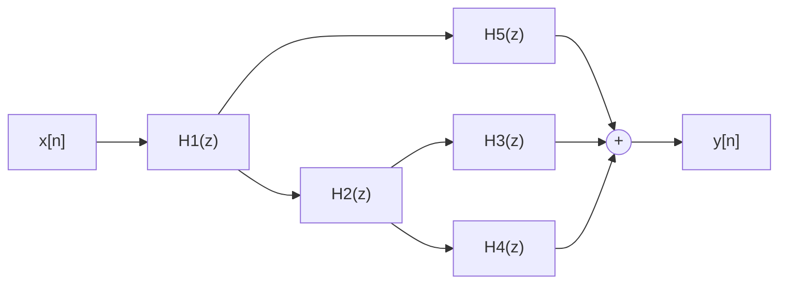

> [!key] Series and parallel (Lecture 10, Table 1)
> | connection | impulse response $h[n]$ | transfer function $H(z)$ |
> |---|---|---|
> | parallel | $h_1[n] + h_2[n]$ | $H_1(z) + H_2(z)$ |
> | series (cascade) | $h_1[n] * h_2[n]$ | $H_1(z)\,H_2(z)$ |
>
> The ROC of the result is **at least** $R_1\cap R_2$ (larger if a [[concepts/pole-zero-cancellation|pole-zero cancellation]] removes a boundary pole). Any network of series and parallel LTI blocks collapses to **one** LTI system.

**Why.** Parallel: $y = x*h_1 + x*h_2 = x*(h_1+h_2)$ (distributivity of [[concepts/convolution|convolution]]). Series: $y = (x*h_1)*h_2 = x*(h_1*h_2)$ (associativity). Convolution is commutative, so **the order of a cascade does not matter** (FA2023 T/F (e), True). In the z-domain these are just $+$ and $\times$ ([[concepts/z-transform-properties|convolution property]]).

> [!recipe] Collapsing a block diagram
> 1. Label the output of every block (and every adder) with its own signal name.
> 2. Write one z-domain equation per block ($W = H_1X$, …) and per adder (sum of its inputs).
> 3. Eliminate the internal signals until only $Y$ and $X$ remain; $H = Y/X$.
> 4. Attach the ROC ($\supseteq$ the intersection) and simplify: cancel common factors before judging poles or stability.

> [!example] Lecture 10 slides: the five-block system above
> The three paths reaching the adder carry $XH_1H_5$, $XH_1H_2H_3$ and $XH_1H_2H_4$, so
> $$
> H(z) = H_1(z)\Big(H_5(z) + H_2(z)\big(H_3(z)+H_4(z)\big)\Big).
> $$
> (Checked by simulating the diagram with random FIR blocks against $x*h$.)

> [!example] SP2025 #3: find the missing parallel branch
> $h_1[n] = \delta[n-1]$ in parallel with an unknown $h_2$. The input $x = \{\underset{\uparrow}{1}, 2, 1\}$ gives $y = \{1, \underset{\uparrow}{2}, 2, 2, 1\}$ (starting at $n=-1$). In the z-domain, $X = 1+2z^{-1}+z^{-2}$ and $Y = z+2+2z^{-1}+2z^{-2}+z^{-3}$; with $H = H_1 + H_2 = z^{-1}+H_2$, find $H_2$.

> [!success]- Answer
> $Y - z^{-1}X = z + 2 + z^{-1} = z\,(1+2z^{-1}+z^{-2}) = zX$, so $H_2(z) = z$, i.e. $h_2[n] = \delta[n+1]$, and $h[n] = \delta[n-1]+\delta[n+1] = \{1, \underset{\uparrow}{0}, 1\}$ — **not causal**. The series twin is FA2024 #3: $x = \{\underset{\uparrow}{1},-1\}$, $h_2 = \{\underset{\uparrow}{2},1\}$, $y = \{4,\underset{\uparrow}{-2},-2\}$ gives $H_1 = \frac{Y}{XH_2} = 2z$, $h_1 = 2\delta[n+1]$.

## Stability of a combination

- **Stable + stable (parallel) is stable**: $\sum|h_1+h_2| \le \sum|h_1| + \sum|h_2|$ (FA2024 T/F (c), FA2023 (c), SP2025 (d): all True).
- **Stable × stable (series) is stable**: $\sum|h_1*h_2| \le \sum|h_1|\cdot\sum|h_2|$.
- **Unstable parts can combine into a stable whole** — by cancellation. Parallel: $u[n] + (\delta[n]-u[n]) = \delta[n]$ (FA2025 T/F (f), "always unstable": False). Series: HW4 #5 cascades an unstable $h_1$ (pole at $1$) with a stable $h_2$ that has a zero at $1$; the product $\frac{z^{-1}}{(1-\frac12 z^{-1})(1-\frac14 z^{-1})}$ is stable (worked on [[concepts/pole-zero-cancellation|pole-zero cancellation]]). SP2021 T/F (c) and FA2019 T/F (d) test exactly this (both False).

## Feedback (beyond Lecture 10)

Lecture 10 covers only series and parallel, and no past Midterm 1 uses a feedback loop. The Singer–Munson notes (§4.10, [[supplements/singer-munson-notes|course notes]]) add it: with forward block $F(z)$, feedback block $G(z)$ and an adder $w = x + G\{y\}$, $y = F\{w\}$,
$$
Y = F\,(X + GY) \quad\Longrightarrow\quad H(z) = \frac{F(z)}{1-F(z)G(z)}
$$
(with a subtracting adder, $w = x - G\{y\}$, it is $\frac{F}{1+FG}$). Example: $F=1$, $G=\frac12 z^{-1}$ gives $\frac{1}{1-\frac12 z^{-1}}$, the recursion $y[n] = \frac12 y[n-1] + x[n]$. A loop needs at least one delay — a delay-free loop cannot be computed.

> [!trap]
> - Parallel **adds**, series **multiplies** — in the time domain series means **convolve**, not multiply $h_1[n]h_2[n]$.
> - The ROC of the combination is "at least" $R_1\cap R_2$: recompute it from the poles that survive cancellation.
> - A **non-causal** block makes the whole cascade non-causal unless something cancels it; watch the $n=0$ bookkeeping when you convolve (SP2025 #3, FA2024 #3).
> - "Two unstable systems can never combine into a stable one" is False (parallel and series); "two stable systems always combine into a stable one" is True.

**Where it appears.**
- Lectures: [[2-z-transform/10-improper-transfer-functions-and-system-algebra|L10]] §2 (series/parallel, Table 1, the five-block example); [[1-signals-and-systems/04-impulse-response-and-convolution|L4]] (convolution properties behind it).
- Problem families: [[problems/finding-h-from-input-output-pairs]] (SP2025 #3, FA2024 #3), [[problems/unbounded-outputs-and-pole-matching]] (FA2019 #10d cascade).
- Homework: [[homework/hw4|HW4]] #5.
- Past exams: [[exams/midterm-1/past-exams/spring-2025|SP2025 #3]], [[exams/midterm-1/past-exams/fall-2024|FA2024 #3]], [[exams/midterm-1/past-exams/fall-2019|FA2019 #10d]]; T/F: [[exams/midterm-1/past-exams/fall-2025|FA2025 (f)]], [[exams/midterm-1/past-exams/spring-2025|SP2025 (d)]], [[exams/midterm-1/past-exams/fall-2024|FA2024 (c)]], [[exams/midterm-1/past-exams/fall-2023|FA2023 (c), (e)]], [[exams/midterm-1/past-exams/spring-2021|SP2021 (c)]], [[exams/midterm-1/past-exams/fall-2019|FA2019 (d)]] — collected in the [[exams/midterm-1/true-false-bank|T/F bank]].

Related: [[concepts/transfer-function]] · [[concepts/convolution]] · [[concepts/pole-zero-cancellation]] · [[concepts/bibo-stability]] · [[concepts/block-diagram]] · [[concepts/lti-system]]

### Sources for this page
Lecture 10 notes §2 (Eqs. 15–20, Table 1, Fig. 1) and annotated slides 10–11 (five-block example); Singer & Munson notes §4.10 (cascade, parallel, feedback $F/(1-FG)$); HW4 #5; exam keys SP2025 #3, FA2024 #3 and the T/F items cited. Verification: `verify/concepts/verify_zdomain_extra.py` (five-block diagram, feedback loops, SP2025 #3 / FA2024 #3 in the z-domain), `verify_systems.py`, `verify/exams/tf_bank.py`.
