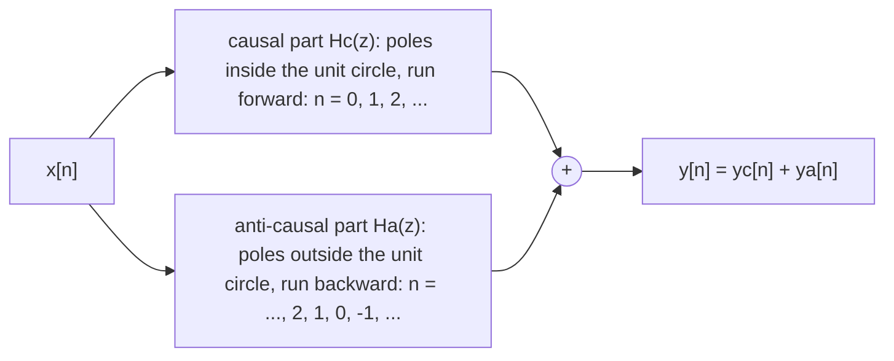

*Problem family · on 2 of 7 past midterms (FA2025, FA2024) · typically 5–8 pts, the second half of a 10–15 pt problem · uses [[1-signals-and-systems/05-difference-equations-and-block-diagrams|Lecture 5]], [[2-z-transform/09-transfer-functions|Lecture 9]], [[2-z-transform/10-improper-transfer-functions-and-system-algebra|Lecture 10]], [[2-z-transform/11-bibo-stability-and-causality|Lecture 11]] · concepts: [[concepts/lccde]], [[concepts/sided-sequences]], [[concepts/system-algebra]], [[concepts/bibo-stability]]*

> [!abstract] In one breath
> A difference equation is one relation between $x$ and $y$. It becomes a system only once you say **which way to solve it**. Solved for the newest output $y[n]$ and run forward, it is the causal system; solved for the oldest output and run backward, it is the anti-causal one. A *stable two-sided* $H(z)$ can be run in neither direction as a whole, so split it: $H = H_c + H_a$ by partial fractions, where the poles inside the unit circle form a causal part (run forward) and the poles outside form an anti-causal part (run backward). Add the two outputs.

## What it looks like on the exam

It comes right after an [[problems/all-possible-rocs|all-possible-ROCs]] part that produced a two-sided, stable $h[n]$:

- [[exams/midterm-1/past-exams/fall-2025|FA2025 #7b]]: "With the above $h[n]$, this LTI system can be implemented as $H(z)=H_1(z)+H_2(z)$ … Determine **BIBO stable difference equations** that implement $H_1$ and $H_2$. Make sure to specify the **directions of recursive computation**, i.e. causal or anti-causal implementations." (#7 is 15 pts in total.)
- [[exams/midterm-1/past-exams/fall-2024|FA2024 #8a]]: "Suppose we have a **non-causal** LTI system described by $y[n]+\alpha y[n-1]=x[n]+3x[n-1]$. For what value(s) of $\alpha$ is it BIBO stable?" (part (a) of a 10-point problem). To answer it you have to know which ROC a non-causal LCCDE has, and why.

Close relatives: [[exams/midterm-1/past-exams/fall-2023|FA2023 #8b]] (the same LCCDE, "non-causal and two-sided": stable for every $\alpha$), [[exams/midterm-1/past-exams/spring-2025|SP2025 #8c]] (the stable two-sided $h$), and the $h[n]=h_l[n]+h_r[n]$ split in the [[2-z-transform/11-bibo-stability-and-causality|Lecture 11]] notes. The parallel connection that justifies adding the two outputs is in [[2-z-transform/10-improper-transfer-functions-and-system-algebra|Lecture 10]].

> [!success]- FA2025 #7, answered (the model solution)
> $H(z) = \dfrac{1-z^{-1}}{(1+2z^{-1})(1+\frac23z^{-1})} = \dfrac{9/4}{1+2z^{-1}} + \dfrac{-5/4}{1+\frac23z^{-1}}$, stable ROC $\tfrac23<\lvert z\rvert<2$, so $h[n] = -\tfrac94(-2)^nu[-n-1]-\tfrac54(-\tfrac23)^nu[n]$.
>
> - $H_1(z) = \dfrac{9/4}{1+2z^{-1}}$, $\lvert z\rvert<2$ (**anti-causal**): $y_1[n]+2y_1[n-1] = \tfrac94x[n]$, run **backward in time**: $y_1[n-1] = -\tfrac12\,y_1[n] + \tfrac98\,x[n]$.
> - $H_2(z) = \dfrac{-5/4}{1+\frac23z^{-1}}$, $\lvert z\rvert>\tfrac23$ (**causal**): run **forward in time**: $y_2[n] = -\tfrac23\,y_2[n-1] - \tfrac54\,x[n]$.
> - $y[n] = y_1[n]+y_2[n]$. Both recursions have a coefficient of magnitude $<1$ in the direction they run ($\tfrac12$ and $\tfrac23$): both are stable.



## The recipe

> [!recipe] Implementing a stable two-sided $H(z)$
> 1. **PFE and ROC.** $H(z) = \sum_k \dfrac{A_k}{1-p_kz^{-1}}$ (plus $C_kz^{-k}$ terms if improper). The stable ROC is the annulus containing $\lvert z\rvert=1$.
> 2. **Split by pole magnitude.** $H_c(z) = \sum_{\lvert p_k\rvert<1}\dfrac{A_k}{1-p_kz^{-1}}$ (plus any $C_kz^{-k}$ terms), and $H_a(z) = \sum_{\lvert p_k\rvert>1}\dfrac{A_k}{1-p_kz^{-1}}$. A group with several poles, or a conjugate pair, is combined over its common denominator into one higher-order recursion.
> 3. **Causal part:** cross-multiply, $y_c[n]-p\,y_c[n-1] = A\,x[n]$, solve for the **newest** sample:
> $$
> \begin{gathered}
> y_c[n] = p\,y_c[n-1] + A\,x[n],\\
> n = \dots,0,1,2,\dots\ \ (\text{at rest before the input starts}).
> \end{gathered}
> $$
> 4. **Anti-causal part:** the same cross-multiplication, $y_a[n]-p\,y_a[n-1] = A\,x[n]$, but solve for the **oldest** sample:
> $$
> \begin{gathered}
> y_a[n-1] = \frac1p\,y_a[n] - \frac{A}{p}\,x[n],\\
> n = \dots,2,1,0,-1,\dots\ \ (\text{at rest after the input ends}).
> \end{gathered}
> $$
> Shifted by one, this is $y_a[n] = \frac1p\,y_a[n+1]-\frac{A}{p}\,x[n+1]$: the output depends on *future* samples only.
> 5. **Add:** $y[n] = y_c[n] + y_a[n]$ (a parallel connection).
>
> **Checks.** In the direction each recursion runs, its feedback coefficient must have magnitude $<1$ ($\lvert p\rvert<1$ forward, $\lvert 1/p\rvert<1$ backward). Feed in $\delta[n]$: forward gives $A\,p^n u[n]$ ($y_c[0]=A$); backward gives $y_a[-1] = -A/p$, $y_a[-2] = -A/p^2$, …, i.e. $-A\,p^nu[-n-1]$, the left-sided pair ✓.

> [!key] What "non-causal LCCDE" means
> $y[n]+\alpha y[n-1] = x[n]+3x[n-1]$ fixes $H(z) = \dfrac{1+3z^{-1}}{1+\alpha z^{-1}}$ and nothing else. **Causal** means ROC $\lvert z\rvert>\lvert\alpha\rvert$, computed forward: $y[n] = -\alpha y[n-1]+x[n]+3x[n-1]$. **Non-causal** (FA2024 #8a) means ROC $\lvert z\rvert<\lvert\alpha\rvert$, computed backward:
> $$
> y[n-1] = \frac{1}{\alpha}\Big(x[n]+3x[n-1]-y[n]\Big).
> $$
> The backward recursion's feedback coefficient is $-1/\alpha$, so it is stable iff $\lvert\alpha\rvert>1$, the key's answer, reached here without an ROC picture. For $\alpha=2$ it produces $h[n] = \tfrac32\delta[n]+\tfrac12(-2)^nu[-n-1]$, which is the left-sided inverse of $H(z)$. With two poles on opposite sides of the unit circle ("non-causal and two-sided", FA2023 #8b) neither direction works for the whole equation, and you split it as above.

> [!trap] Where the points go
> - **Running the anti-causal part forward.** $y_1[n] = -2y_1[n-1]+\tfrac94x[n]$ is the *causal* system with ROC $\lvert z\rvert>2$: its impulse response is $\tfrac94(-2)^nu[n]$ and it blows up. Same equation, wrong direction.
> - **Dividing only half the equation.** From $y_1[n]+2y_1[n-1] = \tfrac94x[n]$: $y_1[n-1] = -\tfrac12y_1[n]+\tfrac98x[n]$. The $x$ coefficient is divided by 2 as well ($\tfrac98$, not $\tfrac94$).
> - **Pole sign.** $\dfrac{A}{1+2z^{-1}}$ has $p=-2$; the recursion is $y[n]+2y[n-1]=A\,x[n]$, not $y[n]-2y[n-1]$.
> - **Which part is which.** For the stable choice, poles *inside* the unit circle go to the causal part and poles *outside* to the anti-causal part. Not "the first term" and "the second term".
> - **Say the direction.** FA2025 #7b asks for it explicitly: write "causal, forward in time" and "anti-causal, backward in time" next to each recursion.
> - **Conjugate pairs stay together.** Both poles of a pair are on the same circle, so they go to the same part, combined into one real second-order recursion.
> - **Non-causal is not unstable.** FA2024 #8a is stable for $\lvert\alpha\rvert>1$, FA2023 #8b for every $\alpha$. Causality and stability are separate questions ([[2-z-transform/11-bibo-stability-and-causality|Lecture 11]], Table 1).

## Practice problems

> [!question] Practice 1 — split and run
> A BIBO-stable LTI system has
> $$
> H(z) = \frac{3-4z^{-1}}{(1-\frac12z^{-1})(1-3z^{-1})} .
> $$
> (a) Find $h[n]$. (b) Write $H = H_1+H_2$ and give a stable difference equation for each part, with its direction of computation. (c) For $x[n] = \delta[n]$, compute $y_2[-1], y_2[-2], y_2[-3]$ from your backward recursion and compare with $h[n]$.

> [!success]- Solution
> **(a)** Cover-up: $A = \dfrac{3-4\cdot2}{1-3\cdot2} = 1$ at $p=\tfrac12$, $\ B = \dfrac{3-4\cdot\frac13}{1-\frac12\cdot\frac13} = \dfrac{5/3}{5/6} = 2$ at $p=3$. Stable ROC $\tfrac12<\lvert z\rvert<3$:
> $$
> h[n] = \left(\tfrac12\right)^n u[n] - 2\,(3)^n u[-n-1] .
> $$
> **(b)**
> - $H_1(z) = \dfrac{1}{1-\frac12z^{-1}}$, $\lvert z\rvert>\tfrac12$, **causal, forward in time**: $y_1[n] = \tfrac12\,y_1[n-1] + x[n]$.
> - $H_2(z) = \dfrac{2}{1-3z^{-1}}$, $\lvert z\rvert<3$, **anti-causal, backward in time**: $y_2[n]-3y_2[n-1] = 2x[n]$, so $y_2[n-1] = \tfrac13\,y_2[n] - \tfrac23\,x[n]$.
> - $y[n] = y_1[n]+y_2[n]$. Feedback coefficients $\tfrac12$ (forward) and $\tfrac13$ (backward): both stable.
>
> **(c)** At rest in the future ($y_2[n]=0$ for $n\ge0$, since $x$ is zero after $n=0$): $y_2[-1] = \tfrac13\cdot0-\tfrac23\cdot1 = -\tfrac23$, $\ y_2[-2] = \tfrac13(-\tfrac23) = -\tfrac29$, $\ y_2[-3] = -\tfrac{2}{27}$. The left-sided term of $h$ gives $-2\cdot3^{-1}$, $-2\cdot3^{-2}$, $-2\cdot3^{-3}$: the same ✓. Running $y_2[n] = 3y_2[n-1]+2x[n]$ forward instead gives $2\cdot3^nu[n]$, which diverges.

> [!question] Practice 2 — one LCCDE, three systems
> $$
> y[n] = \tfrac{10}{3}\,y[n-1] - y[n-2] + x[n] .
> $$
> (a) Find $H(z)$ and all LTI systems this equation can describe (ROC, $h[n]$, causal?, stable?). (b) For the causal and anti-causal ones, write the recursion in the direction it runs. (c) Implement the stable one with two first-order recursions.

> [!success]- Solution
> **(a)** $H(z) = \dfrac{1}{1-\frac{10}{3}z^{-1}+z^{-2}} = \dfrac{1}{(1-3z^{-1})(1-\frac13z^{-1})} = \dfrac{9/8}{1-3z^{-1}} + \dfrac{-1/8}{1-\frac13z^{-1}}$
> (cover-up: $\frac{1}{1-\frac19}=\frac98$ at $p=3$, $\ \frac{1}{1-9}=-\frac18$ at $p=\frac13$).
>
> | ROC | $h[n]$ | type | stable? |
> |---|---|---|---|
> | $\lvert z\rvert>3$ | $\tfrac98\,3^nu[n]-\tfrac18(\tfrac13)^nu[n]$ | causal | no |
> | $\tfrac13<\lvert z\rvert<3$ | $-\tfrac18(\tfrac13)^nu[n]-\tfrac98\,3^nu[-n-1]$ | two-sided | **yes** |
> | $\lvert z\rvert<\tfrac13$ | $-\tfrac98\,3^nu[-n-1]+\tfrac18(\tfrac13)^nu[-n-1]$ | anti-causal | no ($(\tfrac13)^n$ grows as $n\to-\infty$) |
>
> **(b)** Causal: the equation as given, forward: $y[n] = \tfrac{10}{3}y[n-1]-y[n-2]+x[n]$. Anti-causal: solve for the oldest output and run backward: $y[n-2] = \tfrac{10}{3}y[n-1]-y[n]+x[n]$. Both are unstable, because each runs with a characteristic root of magnitude 3 in its own direction.
>
> **(c)** Poles inside go forward, poles outside go backward:
> $$
> \begin{aligned}
> y_c[n] &= \tfrac13\,y_c[n-1] - \tfrac18\,x[n] &&\text{(causal, forward)}\\
> y_a[n-1] &= \tfrac13\,y_a[n] - \tfrac38\,x[n] &&\text{(anti-causal, backward; from }\\
> &&& y_a[n]-3y_a[n-1]=\tfrac98x[n])\\
> y[n] &= y_c[n]+y_a[n].
> \end{aligned}
> $$

## The Python side

The backward recursion is just a loop that runs from the end of the time axis. Here is Practice 1 for $x=\{\underset{\uparrow}{1},\ 2,\ -1\}$, checked against a direct two-sided convolution:

```python
import numpy as np
from scipy.signal import lfilter

n = np.arange(-30, 31)                            # time axis n = -30..30
x = 1.0*(n == 0) + 2.0*(n == 1) - 1.0*(n == 2)    # x = {1, 2, -1}, starting at n = 0
y1 = lfilter([1], [1, -1/2], x)                   # causal part: y1[n] = (1/2)y1[n-1] + x[n], forward
y2 = np.zeros_like(x)                             # anti-causal part, at rest in the far future
for i in range(len(n) - 1, 0, -1):                # n = 30, 29, ..., backward in time
    y2[i-1] = y2[i]/3 - (2/3)*x[i]                # y2[n-1] = (1/3)y2[n] - (2/3)x[n]
h = np.where(n >= 0, 0.5**n, 0) - np.where(n < 0, 2*3.0**np.minimum(n, -1), 0)
y_direct = np.convolve(x, h)[30:91]               # two-sided convolution on the same n axis
print(np.allclose(y1 + y2, y_direct))
print(np.round((y1 + y2)[27:34], 4))              # n = -3..3
```

```text
True
[-0.1152 -0.3457 -1.037  -0.1111  3.1667  0.25    0.125 ]
```

The output is nonzero before the input starts (at $n=-1,-2,\dots$): the anti-causal part responds to *future* input. That is the price of stability here, and it is why such systems are computed offline, on stored data.

## Where to go next

- Concepts: [[concepts/lccde|LCCDE]], [[concepts/sided-sequences|sided sequences]], [[concepts/causality|causality]], [[concepts/bibo-stability|BIBO stability]], [[concepts/system-algebra|system algebra]] (parallel connection), [[concepts/partial-fraction-expansion|PFE]].
- Lectures: [[2-z-transform/11-bibo-stability-and-causality|Lecture 11]] ($h = h_l + h_r$, ROC ↔ causality table), [[2-z-transform/10-improper-transfer-functions-and-system-algebra|Lecture 10]] (parallel systems), [[1-signals-and-systems/05-difference-equations-and-block-diagrams|Lecture 5]] (recursions, initial rest).
- Related families: [[problems/all-possible-rocs|all possible ROCs]] (part (a) of the same exam problem), [[problems/parameters-for-stability|parameters for stability]] (FA2024 #8, FA2023 #8), [[problems/lccde-to-transfer-function-and-response|LCCDE ↔ H(z) ↔ response]].
- Try it: [[demos/difference-equation-simulator|difference-equation simulator]], [[demos/pole-zero-and-roc-explorer|pole–zero and ROC explorer]] (see which ROC makes which part left-sided), [[demos/practice-drills|practice drills]].

### Sources for this page

Lecture 11 notes (§1.1 right-, left- and two-sided systems, $h = h_l + h_r$, Table 1); Lecture 10 notes (parallel connection); Lecture 5 notes (recursive computation from rest); past midterms FA2025 #7 (handwritten key, including the backward recursion $y_1[n-1] = -\frac12y_1[n]+\frac98x_1[n]$), FA2024 #8a, FA2023 #8b, SP2025 #8c. Practice problems are new; every number is checked in `verify/problems/twosided_practice.py` (forward and backward recursions against direct two-sided convolution, exact arithmetic for the LCCDE readings).
